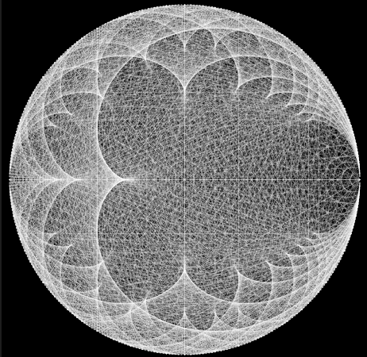

# modular-mult
A very simple visualization of modular multiplication in p5js and processing3

[see it live here](https://editor.p5js.org/greggelong/full/Ma17Y0ztn)

Reading "Descartes' Secret Notebook" got me thinking of geometry, harmony and the universe. So I happened to revisit modular multiplication on my phone. When you don't clear the screen after each multiple, it makes a sort of nice harmonic universe in an egg thingy. Here I have coded it up in just about 30 lines, with a much more simple approach than I used before when following #thecodingtrain.

To create the visualization we need two points on a circle.  They will be the two ends of a line.

We must be familiar with polar to Cartesian coordinates, soh cah toa.  But we only need the soh cah.  

The x, y Cartesian from polar r and theta define a one step move around a circle.

x1 y1 Cartesian from polar r and theta1 defines the other end. 

so drawing the modular multiple 2: theta1 = theta *2 
